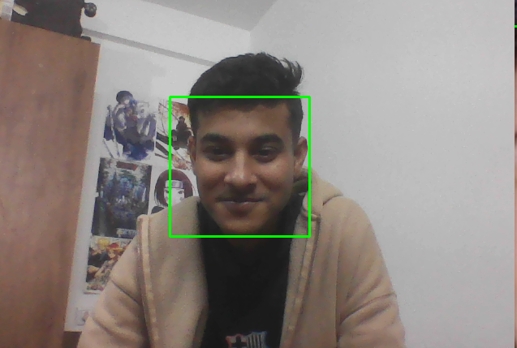

# 🦯 Real-Time Object Detection & Audio Assistance for the Visually Impaired


A real-time computer vision system that detects objects via webcam, estimates their distance using focal-length calibration, and announces them aloud — designed as an assistive tool for visually impaired individuals.

---

## 📸 Demo



> Face detected with bounding box overlay. The system announces detected objects and their estimated distances in real time.

---

## ✨ Features

- 🔍 **Real-time object detection** using YOLOv3 (80 COCO classes)
- 📏 **Distance estimation** via focal-length formula using known real-world object widths
- 🔊 **Text-to-speech announcements** using `pyttsx3` (offline, no API needed)
- 📊 **Live performance metrics** — FPS, CPU %, and RAM % overlaid on the video feed
- 🗂️ **Extensive object catalog** — 200+ objects with real-world widths in `customdata.py`
- 📈 **Evaluation pipeline** to generate precision/recall curves, F1 vs confidence graphs, and confusion matrices

---

## 🧠 How It Works

```
Webcam Frame
     │
     ▼
YOLOv3 Inference  ──►  Bounding Boxes + Class IDs + Confidence Scores
     │
     ▼
Distance Estimation:  distance = (real_width × focal_length) / pixel_width
     │
     ▼
Text-to-Speech:  "Person at 1.2 meters"
     │
     ▼
Display: Annotated frame with FPS / CPU / RAM overlay
```

**Distance Formula:**

```
Distance (cm) = (Real Width of Object × Focal Length) / Pixel Width of Bounding Box
```

---

## 📁 Project Structure

```
├── main.py                  # Main webcam loop — detection, distance, speech
├── yolo_utils.py            # YOLO inference helpers (blob, NMS, drawing)
├── customdata.py            # Real-world widths dictionary (200+ objects)
├── coco.names               # COCO class labels (80 classes)
├── focal_length.txt         # Calibrated focal length value
├── reference_image.png      # Calibration reference image
├── haarcascade_frontalface_default.xml  # (Optional) Haar face cascade
├── evaluate.py              # Evaluation script for labeled datasets
└── README.md
```

> **Note:** `yolov3.cfg` and `yolov3.weights` are not included due to file size. Download them separately (see setup below).

---

## ⚙️ Setup & Installation

### 1. Clone the Repository

```bash
git clone https://github.com/your-username/your-repo-name.git
cd your-repo-name
```

### 2. Install Dependencies

```bash
pip install opencv-python numpy pyttsx3 psutil
```

### 3. Download YOLOv3 Weights & Config

```bash
# Weights (~236 MB)
wget https://pjreddie.com/media/files/yolov3.weights

# Config
wget https://raw.githubusercontent.com/pjreddie/darknet/master/cfg/yolov3.cfg
```

Place both files in the project root directory.

### 4. Calibrate Focal Length (Optional)

If you want to recalibrate for your specific camera:

```bash
python calibrate.py   # or use the existing focal_length.txt value: 742.66
```

---

## 🚀 Running the Application

```bash
python main.py
```

- The webcam feed opens with bounding boxes, distance labels, and FPS/CPU/RAM stats.
- Press **`q`** to quit.
- Speech announces each detected object and its estimated distance (throttled to once every 2 seconds).

### Configuration (inside `main.py`)

| Parameter | Default | Description |
|---|---|---|
| `CONF_THRESHOLD` | `0.5` | Minimum detection confidence |
| `NMS_THRESHOLD` | `0.4` | Non-max suppression overlap threshold |
| `FOCAL_LENGTH` | `900` | Camera focal length (pixels) |
| `ENABLE_SPEECH` | `True` | Toggle text-to-speech output |

---

## 📊 Evaluation (Accuracy Graphs)

To evaluate on a labeled dataset and generate graphs:

```bash
python evaluate.py \
  --images-dir /path/to/dataset/images \
  --labels-dir /path/to/dataset/labels \
  --cfg yolov3.cfg \
  --weights yolov3.weights \
  --names coco.names \
  --output-dir evaluation_outputs
```

### Dataset Format

```
dataset/
  images/
    test1.jpg
    room/0001.png
  labels/
    test1.txt       # YOLO format: class_id x_center y_center width height
    room/0001.txt
```

### Generated Outputs

| File | Description |
|---|---|
| `precision_recall_curve.png` | PR curve across all classes |
| `f1_vs_confidence.png` | F1 score at varying thresholds |
| `confusion_matrix.png` | Per-class confusion heatmap |
| `threshold_metrics.csv` | Precision / Recall / F1 at each threshold |
| `summary.json` | Overall mAP and per-class AP summary |

---

## 📦 Dependencies

| Package | Purpose |
|---|---|
| `opencv-python` | YOLO inference, webcam capture, frame rendering |
| `numpy` | Array operations |
| `pyttsx3` | Offline text-to-speech |
| `psutil` | CPU and RAM monitoring |

---

## 🔭 Future Improvements

- [ ] Upgrade to YOLOv8 for improved accuracy and speed
- [ ] Add GPS / compass integration for outdoor navigation
- [ ] Edge deployment on Raspberry Pi / Jetson Nano
- [ ] Multi-language speech output
- [ ] Obstacle alert with haptic feedback (buzzer)
- [ ] Mobile app wrapper (Android/iOS)

---

## 📄 License

This project is licensed under the MIT License — see the [LICENSE](LICENSE) file for details.

---

## 🙏 Acknowledgements

- [YOLO by Joseph Redmon](https://pjreddie.com/darknet/yolo/) — object detection model
- [OpenCV](https://opencv.org/) — computer vision library
- [pyttsx3](https://pyttsx3.readthedocs.io/) — offline TTS engine
- COCO Dataset — 80-class object labels
